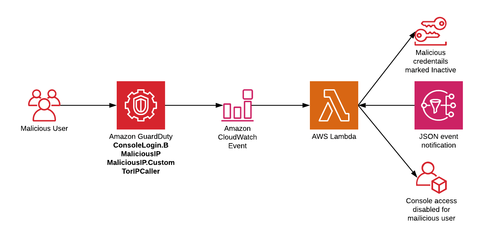

## Amazon GuardDuty malicious IAM user lockout
This template can be used as proof-of-concept for automated response to IAM activity from questionable locations. Using this templates you can protect users from the following types of GuardDuty findings.
* [UnauthorizedAccess:IAMUser/ConsoleLoginSuccess.B](https://docs.aws.amazon.com/guardduty/latest/ug/guardduty_unauthorized.html#unauthorized4)
* [UnauthorizedAccess:IAMUser/MaliciousIPCaller](https://docs.aws.amazon.com/guardduty/latest/ug/guardduty_unauthorized.html#unauthorized5)
* [UnauthorizedAccess:IAMUser/MaliciousIPCaller.Custom](https://docs.aws.amazon.com/guardduty/latest/ug/guardduty_unauthorized.html#unauthorized2)
* [UnauthorizedAccess:IAMUser/TorIPCaller](https://docs.aws.amazon.com/guardduty/latest/ug/guardduty_unauthorized.html#unauthorized1)

You can choose which methods you wish to enable and to prevent lockout, the root user will only have any keys removed and a notificaiton sent out.

## Design

## Prerequisites
You need to have GuardDuty enabled in the region you will deploy this tempalte to.

## Deployment
### Step 1
Create a new CloudFormation stack using the main.yaml template file. For detailed directions about creating a stack, see [https://docs.aws.amazon.com/AWSCloudFormation/latest/UserGuide/cfn-console-create-stack.html](https://docs.aws.amazon.com/AWSCloudFormation/latest/UserGuide/cfn-console-create-stack.html).

### Step 2
You can view the workflow by generating sample findings in GuardDuty. [https://docs.aws.amazon.com/guardduty/latest/ug/guardduty_findings.html#guardduty_sample-findings](https://docs.aws.amazon.com/guardduty/latest/ug/guardduty_findings.html#guardduty_sample-findings)

## License
This library is licensed under the Apache 2.0 License.